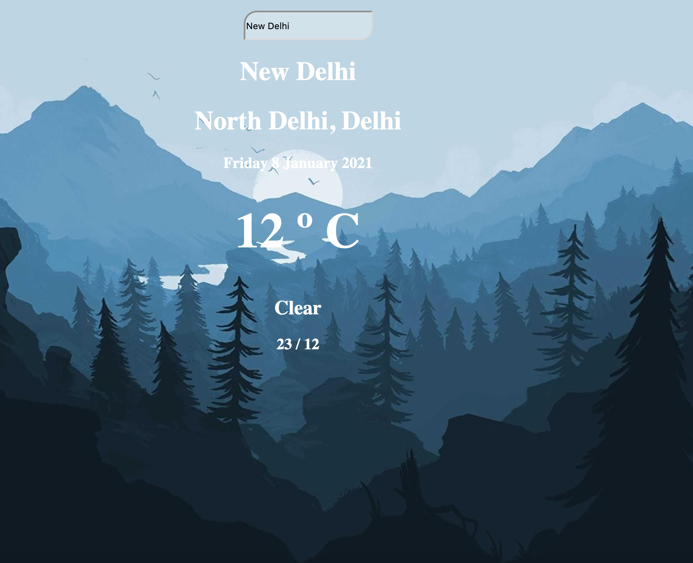

# weather-app
A simple Weather App using React and Styled Components

The forecasting is made using 2 different APIs:

    Mapbox - To obtain city's coordinates.

    OpenWeatherMap - To get forecasting based on coordinates.

Features

    Get Weather Forecast from any city;
    The Background Image changes by current user dateTime;

Original reference repo - https://github.com/Zurkon/weather-geocoding

Disclaimer: 
The assets and api have been taken from original repo. I have created this repo without create react app utility, setting up everything from scratch and the implementation is different from original repo.
